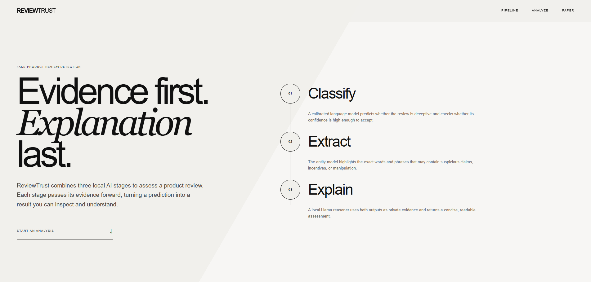
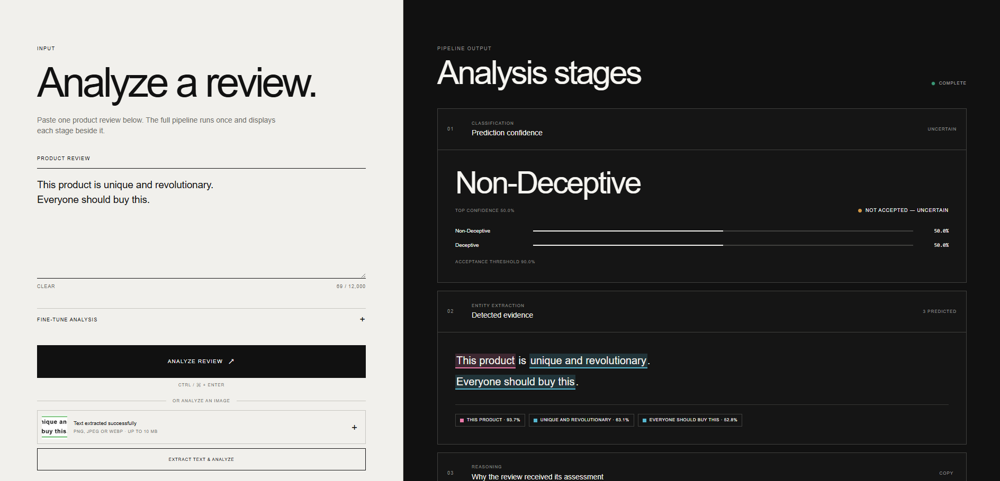

# ReviewTrust

ReviewTrust is a local fake-product-review analysis app. It accepts review text or an image and presents the result in three readable stages.



## Pipeline

1. **OCR (optional)** — DeepSeek-OCR extracts review text from PNG, JPEG, or WebP images.
2. **Classification** — a calibrated ModernBERT model predicts deceptive or non-deceptive probabilities and rejects low-confidence decisions as uncertain.
3. **Evidence extraction** — GLiNER2 highlights suspicious phrases and displays each entity probability.
4. **Explanation** — a local Llama model explains the classifier result using evidence found in the review.



## Requirements

- Python 3.10+
- The trained classifier files in `models/`
- Internet access for the first GLiNER2, Llama, and DeepSeek-OCR download
- An NVIDIA CUDA GPU for image OCR; text-only analysis can run on CPU

The classifier is not included in Git. Place these files in `models/`:

```text
config.json
model.safetensors
tokenizer.json
tokenizer_config.json
temperature.json
```

## Run on Windows

```cmd
cd /d "D:\Project\Fraud Review Detection"
conda activate pytorchgpu
python -m pip install -r requirements.txt
python -m uvicorn app.main:app --host 127.0.0.1 --port 8001
```

Open [http://127.0.0.1:8001](http://127.0.0.1:8001).

The application automatically creates and manages `.venv-ocr`. Do not activate it manually.

## Usage

- Paste a product review and select **Analyze review**.
- Or upload a review image and select **Extract text & analyze**.
- Read the classification, highlighted evidence, and explanation on the right.

Downloaded model weights are stored in `cache/`. Deleting that folder is safe while the server is stopped, but the models will be downloaded again.

## Tests

```cmd
python -m pytest -q
```

ReviewTrust is a decision-support tool; its output is not proof of fraud.
