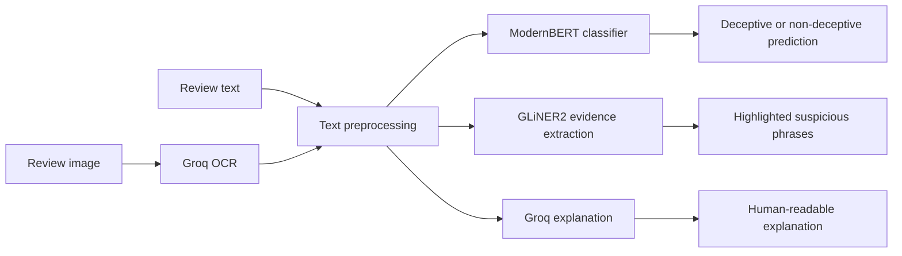

# ReviewTrust

### Detect suspicious product reviews with explainable AI

Analyze review text or upload a screenshot to estimate whether a product review is deceptive, identify suspicious evidence, and generate a concise explanation.


ReviewTrust is a FastAPI web application that combines a locally hosted classifier and entity extractor with Groq-hosted language models for image transcription and explanations.

**[Overview](#1-project-overview) · [Tech stack](#2-tech-stack) · [Workflow](#3-ai-workflow) · [Installation](#4-install-and-run) · [API](#5-api-endpoints) · [Testing](#6-testing)**

## 1. Project Overview

ReviewTrust helps reviewers investigate potentially manipulated product reviews. It accepts either plain text or an image containing a review and returns:

- a deceptive or non-deceptive classification with confidence;
- highlighted evidence such as review instructions, rewards, contact details, links, and suspicious claims;
- an explanation generated from the review text.

The application supports two analysis modes:

1. Paste review text and select **Analyze review**.
2. Upload a PNG, JPEG, or WebP screenshot and select **Extract text & analyze**.


The classifier and entity extraction stages run locally. Image transcription and explanations use the Groq API. Review text and uploaded images are processed in memory and are not stored by the application.

> ReviewTrust is a decision-support tool. Its output is not proof that a review is fraudulent.

## 2. Tech Stack

<p align="center">
  
  
  
  
  
  
</p>
<p align="center">
  
  
  
  
</p>

## 3. AI Workflow



The classifier uses a calibrated threshold and can return an uncertain result when prediction confidence is too low. The entity extractor applies label-specific thresholds to reduce noisy highlights.

## 4. Install and Run

### Requirements

- Python 3.10 or newer
- Internet access for the first GLiNER2 model download and Groq requests
- A Groq Cloud API key for image transcription and explanations
- The fine-tuned classifier checkpoint in `models/`
- An NVIDIA CUDA GPU is optional; local models can run on CPU

### Windows PowerShell

From the project root:

```powershell
python -m venv .venv
.\.venv\Scripts\python.exe -m pip install -r requirements.txt
```

Create a `.env` file in the project root:

```dotenv
GROQ_API_KEY=gsk_your_key_here
```

Start the server:

```powershell
.\.venv\Scripts\python.exe -m uvicorn app.main:app --host 127.0.0.1 --port 8001
```

Open [http://127.0.0.1:8001](http://127.0.0.1:8001) in your browser.

The first run downloads GLiNER2 into `cache/`. Keep the terminal open while using the application. The server logs model-loading errors and reports readiness at `/api/health`.

### Required classifier files

The classifier checkpoint is expected in `models/`:

```text
models/
├── config.json
├── model.safetensors
├── temperature.json
├── tokenizer.json
└── tokenizer_config.json
```

The `models/` directory is gitignored because the checkpoint is large. A fresh clone can start the web page, but analysis requires these files.

### Configuration

Runtime settings are defined in [config.yaml](config.yaml), including classifier and tokenizer settings, GLiNER2 thresholds, Groq request settings, and input limits.

Never put the API key in `config.yaml` or commit `.env`.

## 5. API Endpoints

| Method | Endpoint | Description |
| --- | --- | --- |
| `GET` | `/` | Web application |
| `GET` | `/api/health` | Pipeline and hosted-model readiness |
| `GET` | `/api/defaults` | Current application defaults |
| `POST` | `/api/analyze` | Analyze review text |
| `POST` | `/api/analyze-image` | Transcribe and analyze an uploaded image |
| `GET` | `/docs` | Interactive OpenAPI documentation |

Example text request:

```powershell
curl.exe -X POST http://127.0.0.1:8001/api/analyze `
  -H "Content-Type: application/json" `
  -d '{"text":"Amazing product! Please contact me for a discount and leave a five-star review."}'
```

## 6. Testing

The test suite runs offline. Hosted Groq calls are replaced with injected fake clients.

```powershell
.\.venv\Scripts\python.exe -m pytest -q
```

## Project Structure

```text
app/          FastAPI application, routes, schemas, and services
src/          Model inference and Groq client code
tests/        Unit and API tests
models/       Local fine-tuned classifier checkpoint
cache/        Downloaded GLiNER2 model files
images/       README screenshots
config.yaml   Runtime model and threshold configuration
```

## Limitations

- Groq requests require an active API key and may be rate-limited or temporarily unavailable.
- The image-analysis route accepts PNG, JPEG, and WebP files up to 10 MB.
- Local inference can require substantial memory, especially on CPU.
- Predictions should be reviewed alongside the original review and other evidence.
